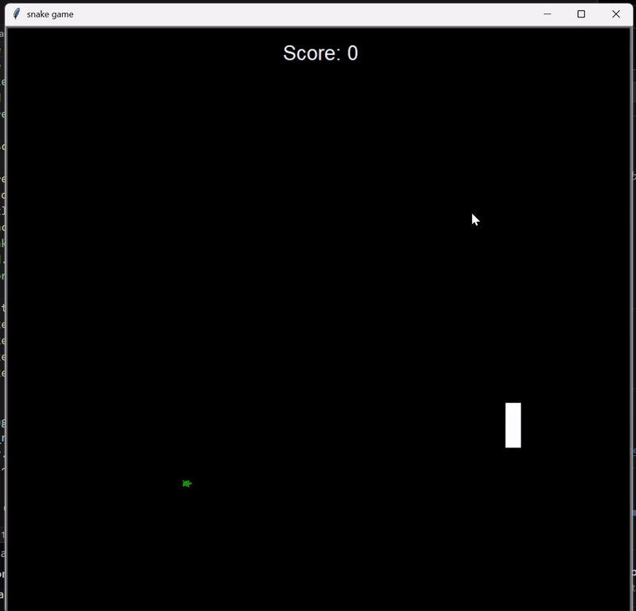

# Snake Game 🐍

A classic snake game implemented in Python using the `turtle` module. This project is just for fun and a great way to reminisce about one of the most iconic games from the past!

---

## Features

- **Snake Movement:** Control the snake using arrow keys.
- **Food:** The snake grows in size and the score increases every time it eats the food.
- **Scoreboard:** Displays the current score and shows "Game Over" when the game ends.
- **Collision Detection:** Ends the game when the snake collides with itself or the walls.
- **Speed:** Smooth gameplay with adjustable frame updates.

---

## Gameplay Instructions

1. Clone this repository:
```bash
git clone https://github.com/ChandhanSaai/Snake-game.git
cd snake_game
```
2. Run the game:
```bash
python main.py
```
3. Use the arrow keys to control the snake:
```bash
- Right Arrow: Move right
- Left Arrow: Move left
- Up Arrow: Move up
- Down Arrow: Move down
```
## File Structure
- `food.py:` Manages the food object, including its appearance and random repositioning.
- `main.py:` The main script that initializes the game, manages game logic, and handles user input.
- `scoreboard.py:` Handles the scoring system and displays the game-over message.
- `snake.py:` Defines the snake class, including its movement, growth, and collision handling.
## How the Game Works
- Start the game, and your snake will appear on the screen.
- Use the arrow keys to navigate the snake toward the green turtle-shaped food.
- Each time the snake eats food, it grows in size, and your score increases.
- Avoid colliding with the walls or the snake's own body.
## Preview

## Tech Stack
- Language: Python
- Library: Turtle Graphics
## Contributions
- This is a fun project, but feel free to suggest any improvements or enhancements! You can fork the repository, make changes, and submit a pull request.
